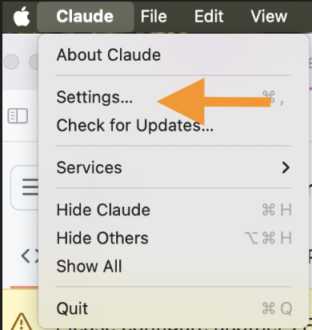

# oracle

Oracle continuously scans the internet for Indicators of Compromise (IOCs), aggregates and stores them in a high-performance vector database, and leverages Generative AI to analyze patterns, correlate threats, and generate proactive threat-hunting hypotheses.

# Hosted oracle
Oracle MCP server is hosted at [https://oracle.cyberdojo.ai/sse](https://oracle.cyberdojo.ai/sse). you can sue any MCP client to connect to oracle MCP server.

## Using Anthropic Claude Desktop
You can use any client to MCP client to access oracle MCP server. Follow the following steps to configure Claude Desktop:

1. Download and install Claude Desktop at [https://claude.ai/download](https://claude.ai/download)
2. Go to Settings:


3. Then go to Developer -> Edit Config. 


4. Then use the following JSON in your configuration file

```json
{
  "mcpServers": {
    "Oracle": {
      "command": "npx",
      "args": [
        "mcp-remote",
        "https://oracle.cyberdojo.ai/sse"
      ]
    }
  }
}
```

5. Enjoy fetching threats information


# Local Installation

To lunch oracle, you will need to use docker compose. Execute the following command:

```bash
docker compose up -d
```
